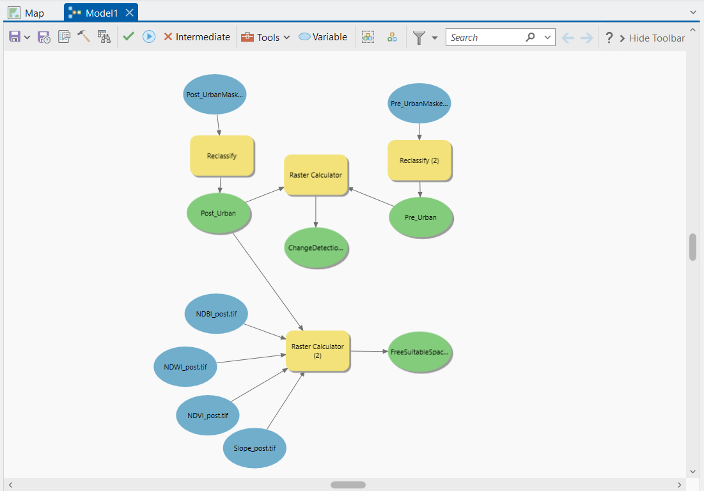
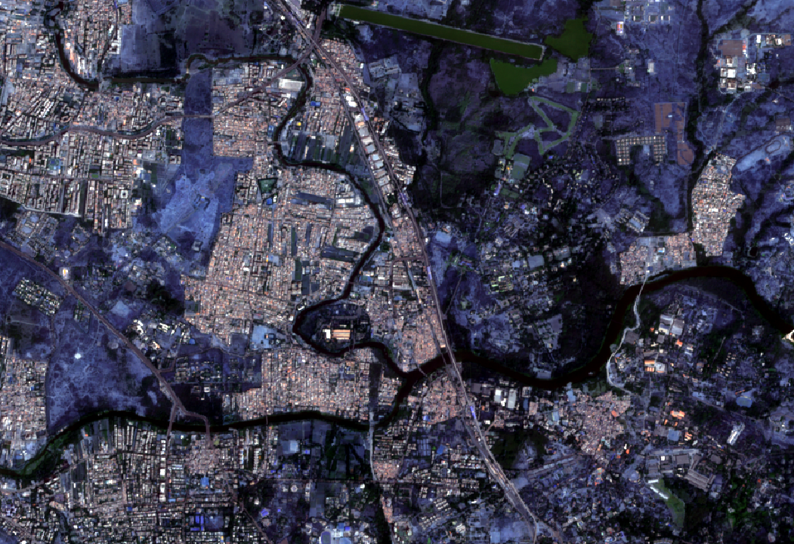
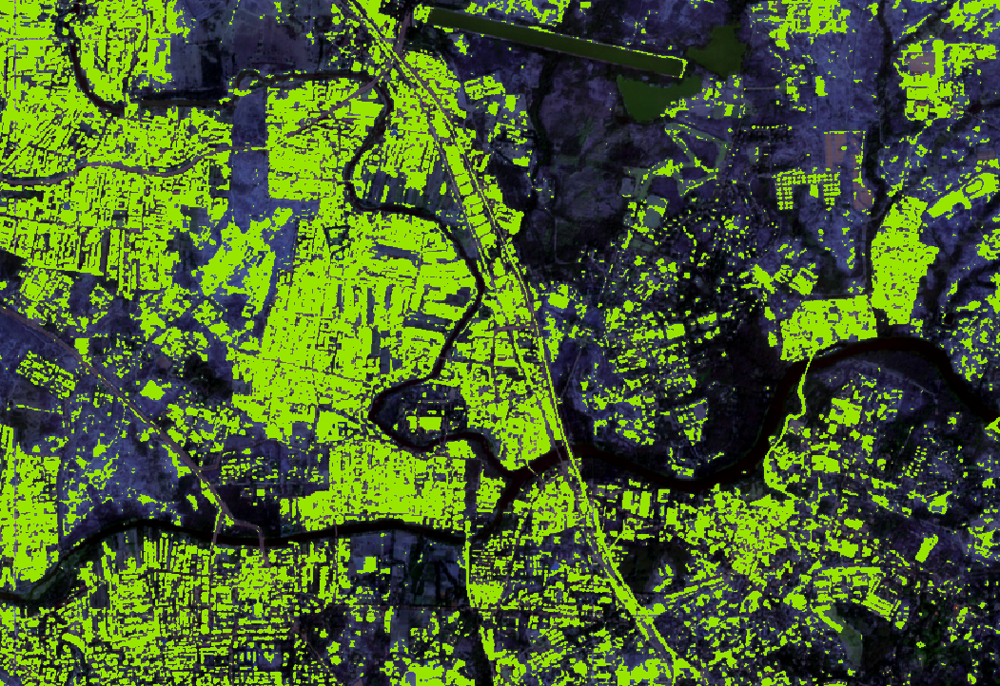
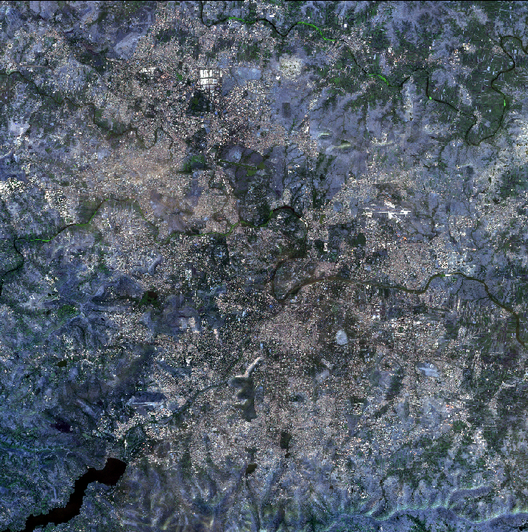
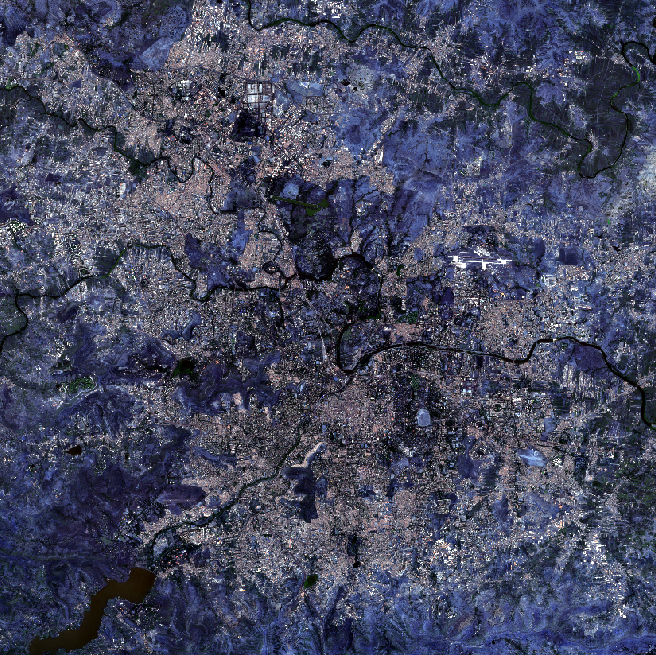
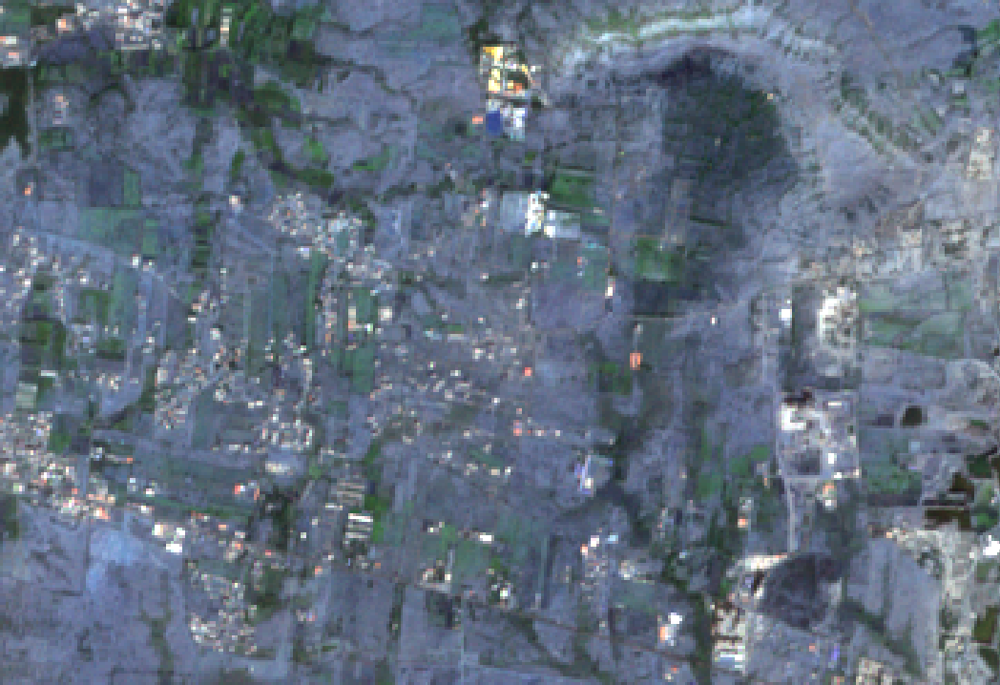
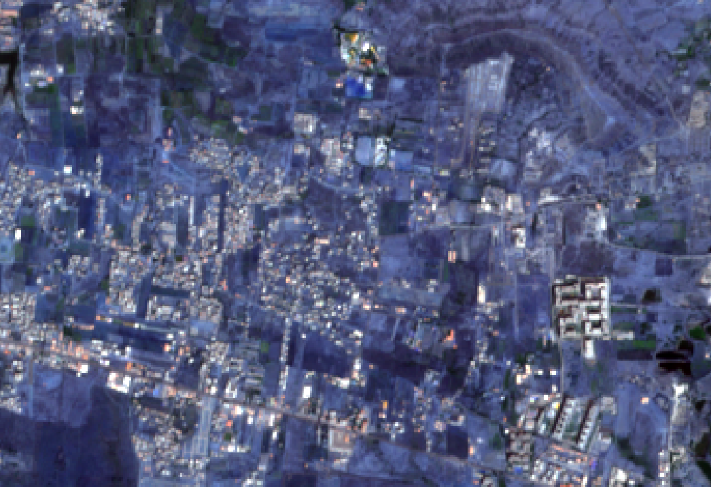
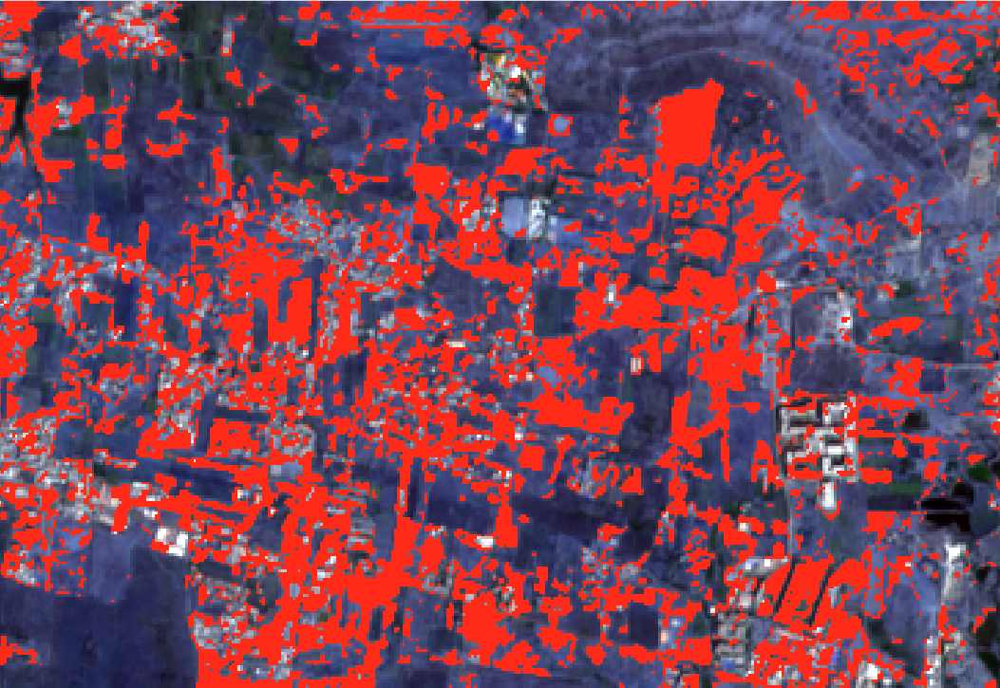
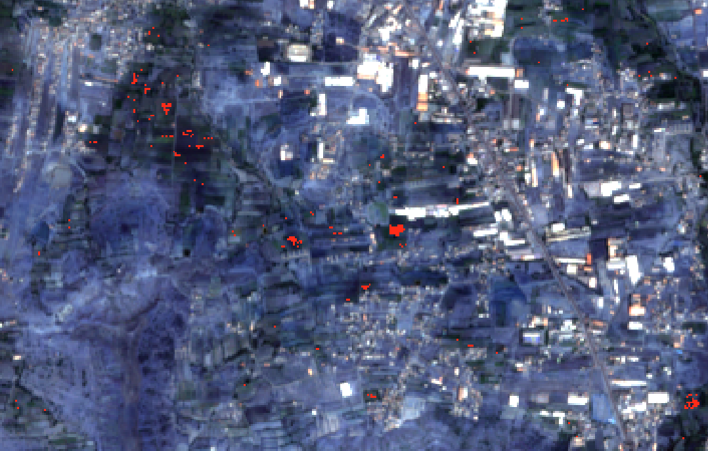

# Urban Building Mask Detection

This project performs **building footprint segmentation** using the **MIT Buildings Dataset**, generating **urban masks** that can be exported and used in GIS platforms such as **ArcGIS**.  
A U-Net model is trained to segment building structures from satellite imagery, producing high-quality binary masks for further spatial analysis.

## Project Overview

- **Dataset:** MIT Buildings Dataset  
- **Model:** U-Net (PyTorch)  
- **Goal:**  
  - Detect building footprints from satellite tiles  
  - Generate binary masks of urban areas  
  - Export the masks into TIFF format for integration with ArcGIS

## Repository Structure

```text
.
├── Images/                    # Sample satellite images and result previews for the readme.md file
├── models/
│   └── unet_best.pth          # Trained model checkpoint 
│   └── history.json           # Trained model 
│   └── Plots.png              # Trained model 
│
├── Predictions/
│   ├── main.ipynb             # Inference notebook
│   ├── Unet.py                # Clean U-Net architecture
│   └── Tiff/                  # Exported GeoTIFF masks 
│
├── ModelTraining.ipynb        # Complete training pipeline
├── ArcGIS project file.zip    # ArcGIS Pro project with
├── EarthEngine3.js            # Google Earth Engine export 
├── .gitignore
└── .gitattributes             # Git LFS settings
```


## Model Training

The U-Net model is trained using the MIT Buildings Dataset with:

- Images (512 x 512) as input to the model
- Data augmentation  
- BCE loss  
- Adam optimizer  

Training pipeline: `ModelTraining.ipynb`

## Inference / Mask Generation

To generate building masks:

1. Load `models/unet_best.pth`
2. Pass satellite tiles into the model
3. Export predictions as PNG or TIFF

The study area selected for this project was Pune. A high-resolution TIFF file covering the entire region was downloaded and then divided into 512 × 512 pixel tiles. Each tile was processed through the deep learning model to generate predictions. After obtaining the predictions for all tiles, they were merged back together to reconstruct the original large TIFF. The reconstructed output was then imported into ArcGIS for further spatial analysis.

Tiling and merging code: `Predictions/main.ipynb`

## GIS Integration

The generated masks can be imported into **ArcGIS Pro** for:
- Urban suitability analysis  
- Change detection  
 


##  ArcGIS Workflow & Spatial Analysis

After generating the building masks using the U-Net model, the outputs were imported into **ArcGIS Pro** for further spatial analysis.  
The GIS workflow automates post-processing, performs change detection, and identifies suitable areas for development.

---

## ArcGIS Model Builder Automation

A custom **Model Builder** pipeline was created to automate:

- Importing predicted masks  
- Raster preprocessing  
- Binary reclassification  
- Raster calculation for change detection in urban
- Raster calculation for finding land suitability for urban buildings


This ensures reproducible and scalable spatial analysis.



---

## Urban Mask Generated by Deep Learning

The U-Net model detects building footprints and produces a binary mask that can be visualized in ArcGIS.

### 🔹 Original Urban Tile  


### 🔹 Predicted Mask  


---


## Urban Change Detection (2016 → 2023)

Using satellite images from 2016 and 2023, ArcGIS computes:

- Built-up expansion  
- Loss of open land  
- Urban growth hotspots

### 🔹 2016 Image  


### 🔹 2023 Image  



### **Formula Used**
Urban_change = Urban_post_mask - Urban_pre_mask

### 🔹 Change Visualization  
2016 vs 2023

| Year | Image |
|------|--------|
| 2016 |  |
| 2023 |  |
| 2016-2023 |  |
---


## Suitability Analysis

Using the predicted mask, ArcGIS identifies **free and suitable areas** that are:

- Non-built-up  
- Not overlapping with urban regions  
- Spatially feasible for development

### 📌 Suitability Formula
```python
Con(
    ("%NDWI_post.tif%" < 0) &
    ("%NDVI_post.tif%" < 0.3) &
    ("%NDBI_post.tif%" < -0.1) &
    ("%Slope_post.tif%" <= 15) &
    ("%Post_Urban%" != 1),
    1,
    0
)
```

### 🔹 Suitable Locations  


---

## Summary of ArcGIS Tasks

- Automated processing using **Model Builder**  
- Performed **urban growth change detection**  
- Derived **urban masks** from ML predictions  
- Visualized and analyzed suitability areas  


